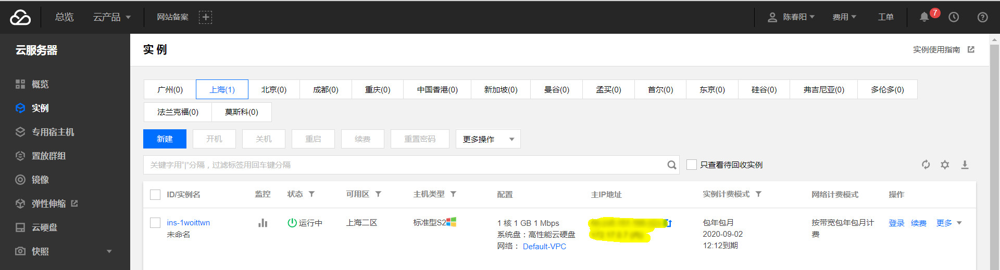
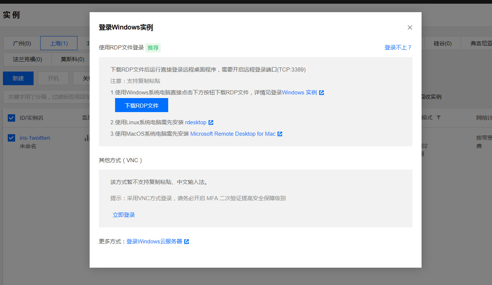
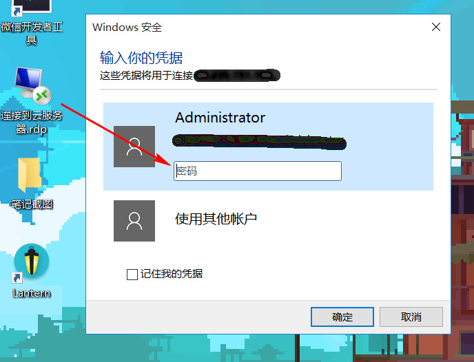
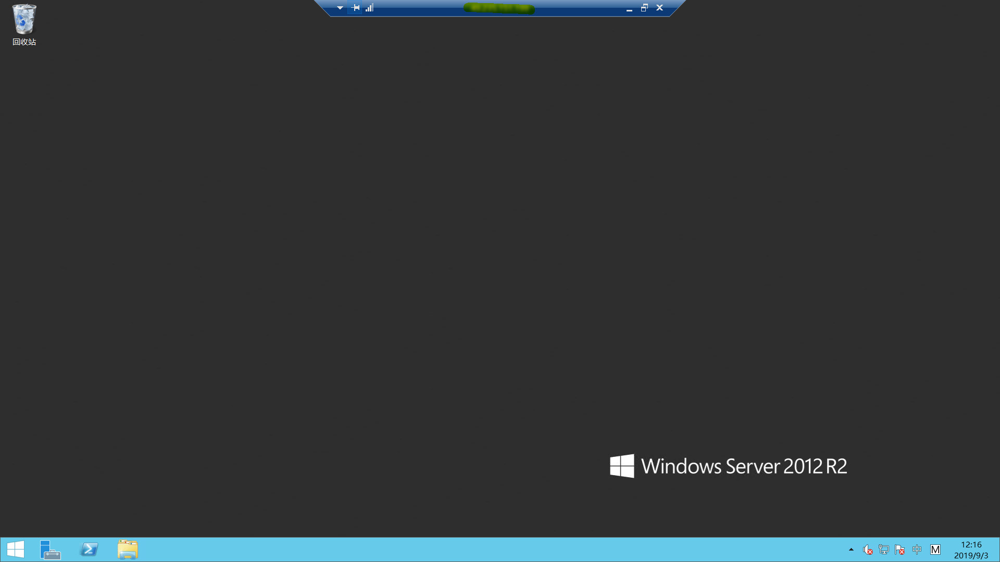
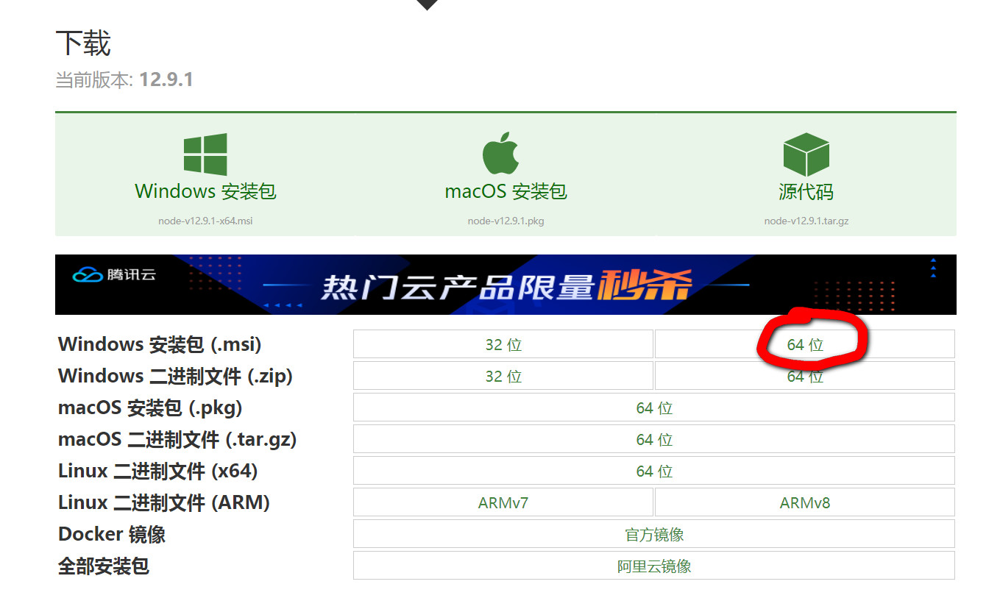
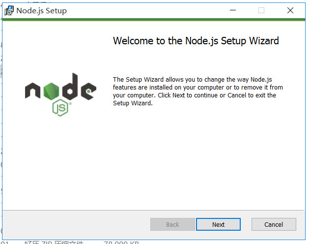
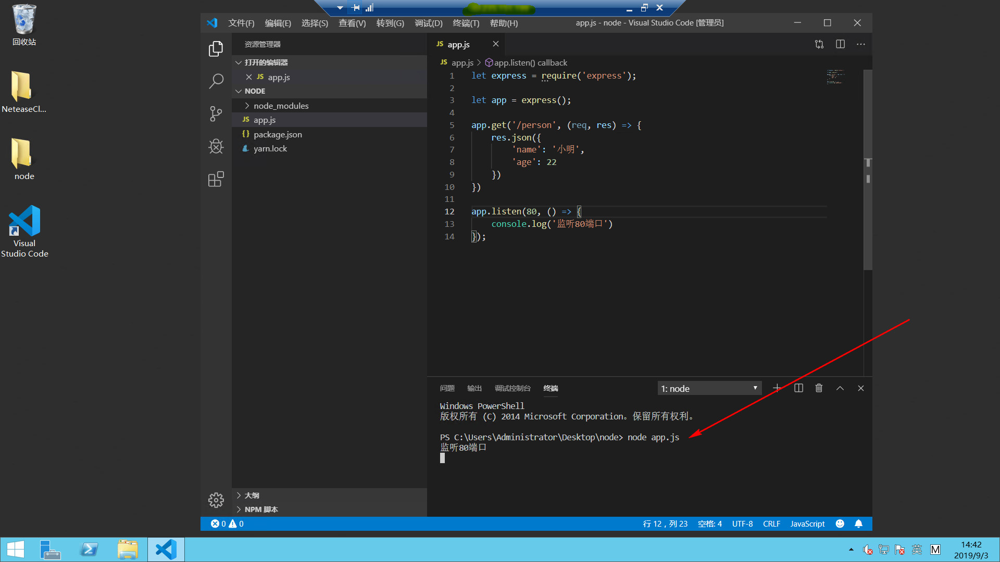
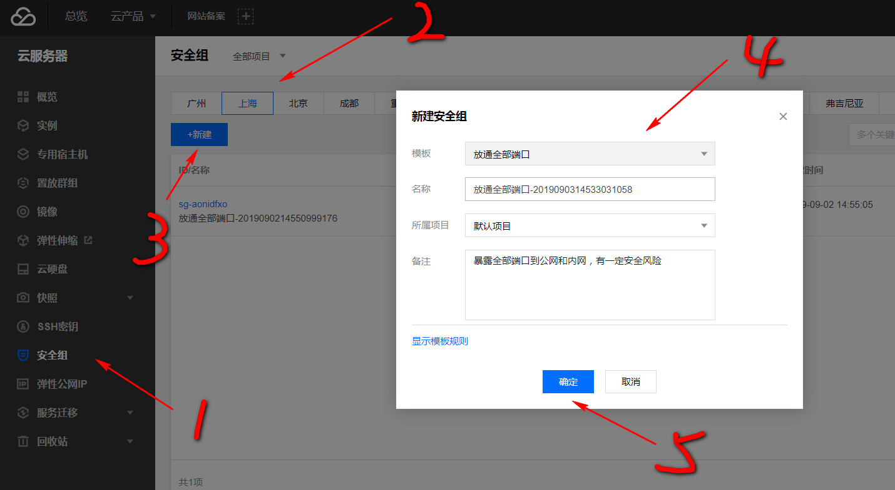
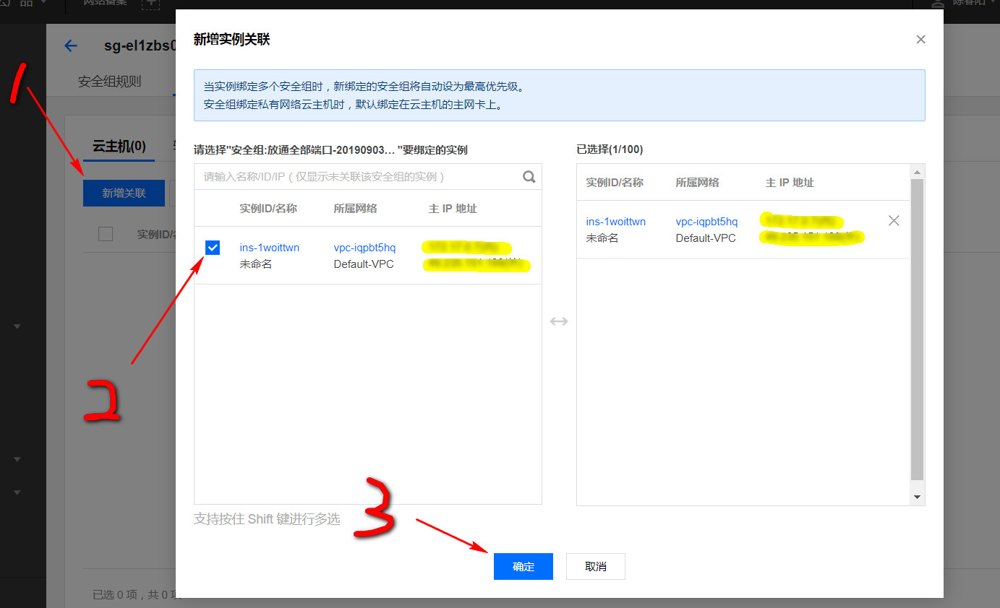
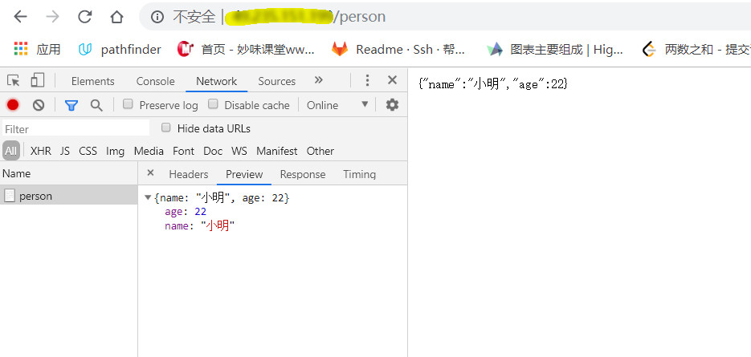

这两天趁着腾讯云有活动，买了一年的入门级云服务器的使用权限，打算用node写一些后台，正好也练习练习node，话不多说，开始折腾！！

#### 登录远程服务器

1、在实例中，找到刚刚购买的服务器（没开机的先开机）


<!-- more -->
2、点击右侧的登录按钮



3、因为我是windows的系统，这里选择第一种方式（如果你是其他的系统或者登录上有什么问题，可以点击上图中蓝色的字查看官方文档），然后会下载一个rdp文件到你的电脑中，之后双击这个文件，输入登录密码登录，密码的设置和重置这里不再说明，需要请查看官方文档



4、输入正确的密码之后，我们就成功连接进来了，可以进行下一步操作了



#### 配置远程服务器node

以下都是在远程链接界面中进行：

1、首先下载node安装包，在官网选择与系统对应的版本，下载地址：http://nodejs.cn/download/



2、安装node（不再详细介绍，主要一点是里面有一项addtopath需要勾选上，意思是添加到环境变量，那么你在磁盘的任意位置都可以使用node命令）



#### 写node接口

下载一个常用的编辑器写node，我下载的是vscode。
1、首先在一个空文件夹下创建app.js文件，然后写入以下代码
``` javascript
let express = require('express');		// 需安装模块npm install express
let app = express();				// 实例化app
app.get('/person', (req, res) => {      	// 接口
    res.json({
        'name': '小明',
        'age': 22
    })
})
app.listen(80, () => {				// 监听80端口
    console.log('监听80端口')
});
```

2、然后vscode的终端中开启node服务（命令：node [文件名].js）（不要忽略上一步中安装express的操作）



#### 配置云服务器安全组

因为我们想通过80端口，从别的机器上访问到/person这个接口，那么我们就需要进行安全组配置，定义入站出站规则。
1、打开之前云服务器后台界面，点击左侧安全组选项，然后在自己服务器的区域选项下点击新建按钮，再选择放通全部端口



2、然后我们需要关联服务器，点击管理实例，新增关联，选择服务器，确定




3、这些配置完成后，我们就可以在自己电脑上的浏览器通过服务器的公网ip成功访问到该接口了



#### 注意问题

1、如果你的安全组并不想开启全部端口，只想开启需要的，那么记的在远程服务器开启node服务的端口号一定要在安全组里面配置，否则会出现连接超时。
2、node服务的端口号并不能任意设置，某些端口号会让部分浏览器访问时报错（ERR_UNSAFE_PORT），可以理解为一种安全策略，以下这些端口号应避免使用：

 >1, // tcpmux
 7, // echo
 9, // discard
 11, // systat
 13, // daytime
 15, // netstat
 17, // qotd
 19, // chargen
 20, // ftp data
 21, // ftp access
 22, // ssh
 23, // telnet
 25, // smtp
 37, // time
 42, // name
 43, // nicname
 53, // domain
 77, // priv-rjs
 79, // finger
 87, // ttylink
 95, // supdup
 101, // hostriame
 102, // iso-tsap
 103, // gppitnp
 104, // acr-nema
 109, // pop2
 110, // pop3
 111, // sunrpc
 113, // auth
 115, // sftp
 117, // uucp-path
 119, // nntp
 123, // NTP
 135, // loc-srv /epmap
 139, // netbios
 143, // imap2
 179, // BGP
 389, // ldap
 465, // smtp+ssl
 512, // print / exec
 513, // login
 514, // shell
 515, // printer
 526, // tempo
 530, // courier
 531, // chat
 532, // netnews
 540, // uucp
 556, // remotefs
 563, // nntp+ssl
 587, // stmp?
 601, // ??
 636, // ldap+ssl
 993, // ldap+ssl
 995, // pop3+ssl
 2049, // nfs
 3659, // apple-sasl / PasswordServer
 4045, // lockd
 6000, // X11
 6665, // Alternate IRC [Apple addition]
 6666, // Alternate IRC [Apple addition]
 6667, // Standard IRC [Apple addition]
 6668, // Alternate IRC [Apple addition]
 6669, // Alternate IRC [Apple addition]


