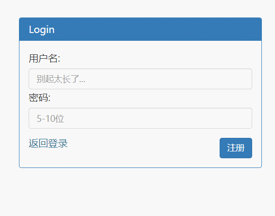
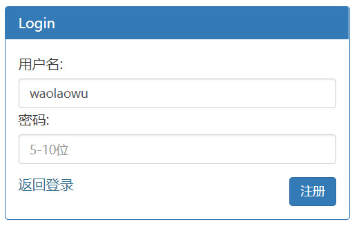
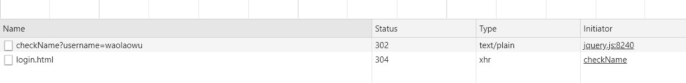
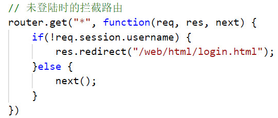
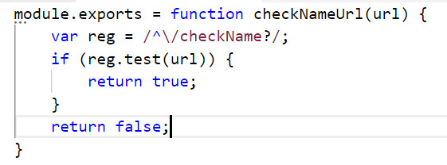
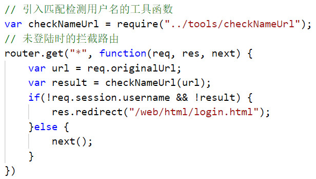

今天在用nodejs写登录注册时候遇到了一个问题，我想实现用户在注册时，如果用户名不为空，失去焦点后发送ajax与mongo数据库中的数据进行对比，数据库中没有用户输入的用户名则显示可用，效果如下：

<!-- more -->
虽然我后来已经实现了，但是当我不知道又弄了哪里的时候，数据不能从后台返回来了。触发验证用户名的事件后，并没有对应的事件发生。

一开始，我怀疑是后台“检查用户名”的接口有问题，但是扫了一遍过后并没有发现哪里不对，我又尝试着去后台打印要接收的用户名，结果后台根本没有接收到，那也就是说前台可能并没有发送过来，前台又找了很久，理了一遍逻辑，也没有发现问题= =，不知所措的我在网页中打开了F12，看看network中触发事件的时候会有什么请求，结果发现除了一个checkName请求（我们需要的），还多了一个login请求，这是什么东西？？

请求中多了一个login，那大概可以确定是这个影响了检查用户名，回想起来之前在”注册”里写的逻辑代码并没有请求这个= =。又看了该页面前端和后端的逻辑，还是没有发现在哪个地方请求了它。
________________________________________________________
就在我抓耳挠腮时，我突然想到了之前又配置了一个路由拦截器，如果session里面没有用户登录的数据，则让他直接跳转到登录页面，于是我就在路由配置里把下面这段代码注释掉了：

果然，一切恢复正常，接着又仔细思考了一下原因：我写这个路由拦截器的目的是防止用户没有登录就直接通过输入url进入其他页面，拦截的是get请求，同时如果我没有登录，在注册验证用户名的时候，同样也是一个get请求，那么该拦截器就会对这个请求进行拦截，并尝试跳转到login界面。在思考清楚了问题过后，我确定再加一个判断，不拦截验证用户名的get请求：
工具函数：

升级过后的路由拦截器：

心得体会：
1、多用F12，在无法确定代码问题的时候，它真的很好用。
2、路由拦截时不能过于暴力，如果项目很大，考虑的情况比较多的话，那就要防止拦截到不该拦截的路由。
_ _ _
November 26, 2018 11:22 AM	更新
其实还有一种更简单的办法，就是将不需要拦截的请求放到拦截器的上面，因为js是从上往下执行的，只要让它能在拦截器的前面执行就可以。