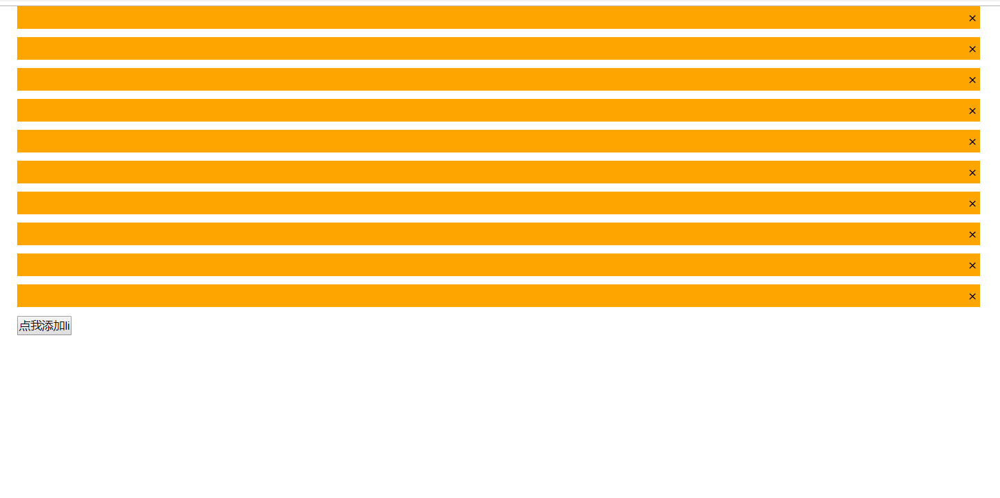

#### 场景引入
假设现在我们要做一个需求，如下图：


<!-- more -->
根据效果我们需要完成的有三件事情：
1. 点击按钮，添加一个Li元素
2. 点击哪个Li就让哪个变色
3. 点击哪个叉（span元素）就让它对应的父元素消失
_______________________________________________________
#### 顺向思维
如果按照一般的思路，可能我们会像下面这么写：
```javascript
	// 给按钮添加点击事件
	btn.onclick = function() {
		// 创建长条元素li
		var li = document.createElement("li");
        // 创建了元素立马加上点击变色事件
		li.onclick = function() {
			this.style.backgroundColor = "red";
		}
        // 创建小叉叉元素span
		var span = document.createElement("span");
        // 创建后同样马上加上移除事件
		span.onclick = function() {
			ul.removeChild(this.parentNode);
		}
		// 添加span的内部文本
		span.innerHTML = "&times;";
		// 上树
		li.appendChild(span);
		ul.appendChild(li);
	}
```
上面是给添加出来的元素写好了效果，但是针对于原来就在页面上存在的元素，我们还需要循环对它们添加事件。
```javascript
	for (var i = 0; i < lis.length; i++) {
		// 给所有li添加点击事件
		lis[i].onclick = function() {
			this.style.backgroundColor = "red";
		}
	}
```
```javascript
	for (var i = 0; i < spans.length; i++) {
		// 给所有span添加点击事件
		spans[i].onclick = function() {
			ul.removeChild(this.parentNode);
		}
	}
```
至此，效果就已经符合需求了。但是现在有一个问题，每次创建了一个新的元素，我们就给它新定义一个事件，也对存在的元素循环添加了事件，虽然看起来事件都一样，都是同一个事件，但是它们在内存中的地址相同吗?很显然它们并不是同一个，每次添加事件都会在内存上重新开辟一块地址来存放事件，虽然看起来一样，但是它们的地址并不一样。可以想象成现在有3个人，他们分别买了一套房子，房子里装修的一模一样，他们房子的占地面积就是3套的占地面积；现在还有另外三个人，他们合租在一起，这时他们的占地面积就是1套的面积。那么我们可能会做如下优化：
```javascript
btn.onclick = function() {
		// 创建元素
		var li = document.createElement("li");
		li.onclick = li_click;
		var span = document.createElement("span");
		span.onclick = span_click;
		// 添加span的内部文本
		span.innerHTML = "&times;";
		// 上树
		li.appendChild(span);
		ul.appendChild(li);
	}
	for (var i = 0; i < lis.length; i++) {
		// 给所有li添加点击事件
		lis[i].onclick = li_click;
	}
	for (var i = 0; i < spans.length; i++) {
		// 给所有span添加点击事件
		spans[i].onclick = span_click;
	}
	// 把事件提取出来，在内存上占用一个地址
	function li_click() {
		this.style.backgroundColor = "red";
	}
	function span_click() {
		ul.removeChild(this.parentNode);
	}
```
就买“两套房子”，谁要使用的话就给谁“配钥匙”，这样就减少了内存的消耗。
_______________________________________________________
#### 继续优化
这时候继续思考，当我们点击叉子符号的时候，实际上只是对当前的li进行了移除，不在页面当中显示了而已，实际上在内存当中，它仍然保持着对点击事件的引用，也就是说它仍然拿着房子钥匙，那部分内存就无法被回收，这就是内存泄漏（无法被重复利用的内存）的隐患。那我们实际上可以考虑另外一种实现方式：
```javascript
	// 给父元素添加点击事件
	ul.onclick = function(e) {
		// 通过e.target属性判断点击是哪个元素
		// console.log(e.target);
		if (e.target.nodeName.toLowerCase() === "li") {
			// 改变背景色
			e.target.style.backgroundColor = "red";
		} else if (e.target.nodeName.toLowerCase() === "span") {
			// 移除对应的父元素
			ul.removeChild(e.target.parentNode);
		}
	}
	// 点击btn添加li
	btn.onclick = function() {
		ul.innerHTML += "<li><span>&times;</span></li>";
	}
```
btn按钮只负责向ul中添加li和span元素，而其他的事件都交给ul元素来处理，交给了父元素来判断，这就是委托模式。
综上，委托模式解决了三件事情：
1. 减少事件的数量
2. 预言未来的元素（不用担心后面添加的元素没有效果）
3. 防止内存泄漏
