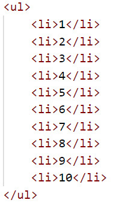
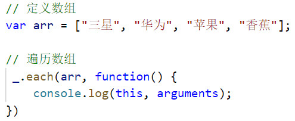
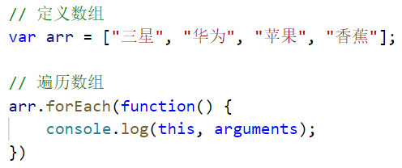
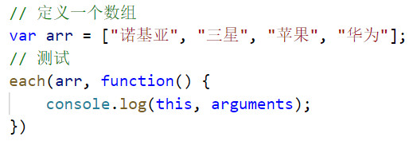

##### Jq中的迭代器
###### dom结构

<!-- more -->
###### js方法

###### 输出
（省略后面重复部分）
###### 定义一个数组及遍历

输出：（this的实质就是每一次遍历到的value的数字包装类型）

______________________________________________________
##### underscore中的迭代器
###### 定义一个数组及遍历

输出：

______________________________________________________
##### es5中的迭代器
###### 定义一个数组及遍历

输出：

______________________________________________________
##### 自己的迭代器
###### 目的
定义一个函数，该函数可以实现对数组和对象的遍历。
```javascript
	/**
	 * each函数 实现迭代器
	 * @target 要遍历的目标
	 * @fn     要执行的函数
	 **/
	function each(target, fn) {
		// 判断传递的target是数组还是对象
		if (target instanceof Array) {
			// 说明传递的是数组
			for (var i = 0; i < target.length; i++) {
				// 执行fn
				fn.call(target[i], target[i], i, target);
			}
		} else if (Object.prototype.toString.call(target) === "[object Object]") {
			for (var i in target) {
				// 传递二个参数
				fn.call(target[i], target[i], i);
			}
		}
	}
```
###### 数组遍历结果


###### 对象遍历结果

